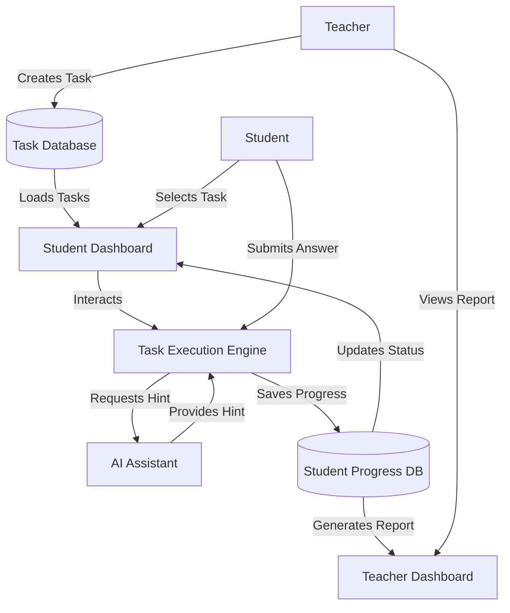

# Learning Task Feature Design Document

## 1. User Stories

### Teacher (Task Creator)
- **Create Task:** As a teacher, I want to create a new learning task with a title, description, and specific instructions so that students know what to do.
- **Categorize:** As a teacher, I want to assign a Grade (1-12), Subject, and Topic to the task for better organization.
- **Add Content:** As a teacher, I want to add various types of content (Text, Images, Video links) to the task.
- **Interaction Types:** As a teacher, I want to choose the type of interaction:
    - **Quiz:** Multiple choice questions.
    - **Fill-in-the-blank:** Sentences with missing words.
    - **Drag & Drop:** Matching items.
    - **AI Feedback:** Open-ended questions where AI provides feedback.
- **Settings:** As a teacher, I want to set a deadline and maximum points for the task.
- **Monitor:** As a teacher, I want to see a dashboard of student progress and scores.

### Student (Interactive Workspace)
- **View Tasks:** As a student, I want to see a list of assigned tasks, filtered by "To Do", "In Progress", and "Completed".
- **Execute Task:** As a student, I want an interactive interface to complete the task (e.g., clicking options, dragging items).
- **AI Assistance:** As a student, I want to ask an AI assistant for hints or explanations if I get stuck.
- **Feedback:** As a student, I want to receive immediate feedback on my answers (for quizzes) or AI-generated feedback (for open-ended questions).
- **Gamification:** As a student, I want to see fun animations or badges when I complete a task.

## 2. Data Flow Diagram

## 3. Database Structure (Zustand Store Schema)

### Task Table
| Field | Type | Description |
|-------|------|-------------|
| `id` | string | Unique identifier |
| `title` | string | Task title |
| `description` | string | Task description |
| `grade` | number | Grade level (1-12) |
| `subject` | string | Subject (Math, Literature, etc.) |
| `topic` | string | Specific topic |
| `type` | enum | 'quiz', 'fill_blank', 'drag_drop', 'ai_response' |
| `content` | object | JSON structure specific to the task type (questions, answers, media) |
| `settings` | object | { deadline: Date, points: number, rubric: string } |
| `createdAt` | Date | Creation timestamp |

### StudentProgress Table
| Field | Type | Description |
|-------|------|-------------|
| `id` | string | Unique identifier |
| `taskId` | string | Reference to Task |
| `studentId` | string | Reference to Student |
| `status` | enum | 'assigned', 'in_progress', 'completed' |
| `score` | number | Achieved score |
| `answers` | object | Student's answers |
| `feedback` | string | AI or Teacher feedback |
| `completedAt` | Date | Completion timestamp |

## 4. UI/UX Requirements
- **Child-friendly:** Large buttons, colorful icons, simple language.
- **Gamified:** Progress bars, confetti on completion.
- **Fast:** Immediate response to interactions.
